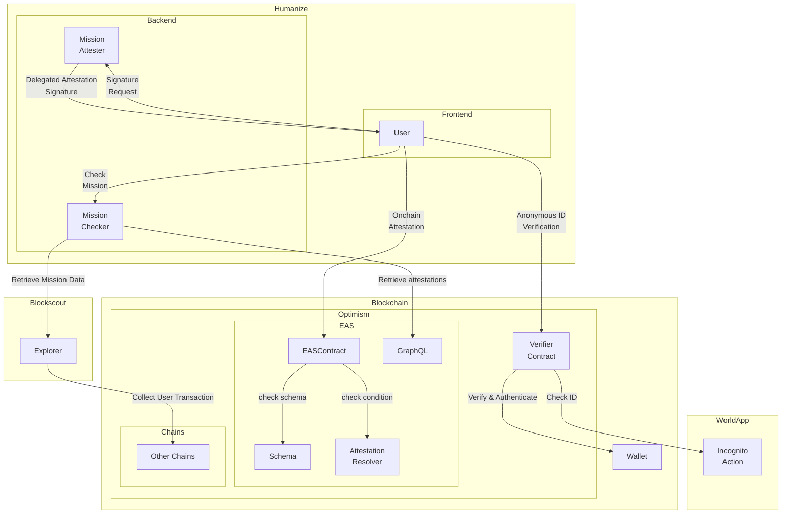
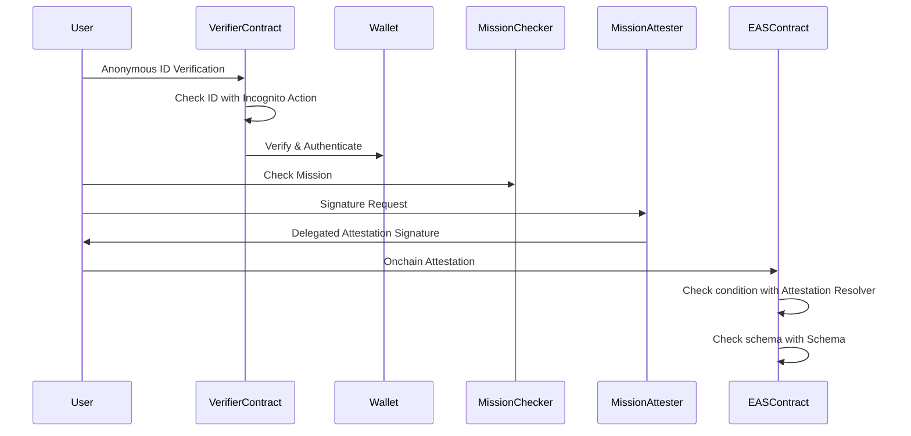

# Humanize

Humanize is a platform that rewards users for their contributions to the blockchain ecosystem.

## Introducing Humanize

Humanize is a groundbreaking application designed to fairly evaluate and reward human contributions to the on-chain economy. By leveraging advanced blockchain technology, Humanize ensures that meaningful activities are recognized and incentivized.

Key Features

- Fair Evaluation: Assess on-chain activities contributing to the blockchain ecosystem using data from Blockscout and other sources.
- Unique Human Authentication: Uses World App’s Incognito Action for on-chain authentication, proving an address belongs to a unique individual while maintaining anonymity.
- Permanent Attestations: Store evaluation results as attestations with the Ethereum Attestation Service (EAS), creating a verifiable record.
- Multi-Chain Insights: Evaluate activities across multiple chains, providing a comprehensive view of user interests and contributions.

Use Cases

- Airdrops: Reward users based on their contributions.
- Employment: Use attestations as credentials for job applications.
- Education: Recognize participation in learning programs.
- Ecosystem Expansion: Identify and collaborate with active contributors.

Humanize sets a new standard for recognizing positive human activities in the blockchain space, empowering individuals and strengthening the ecosystem. Join us in building a more inclusive and dynamic blockchain community.

## Architecture

- Architecture Diagram
  

- Sequence Diagram
